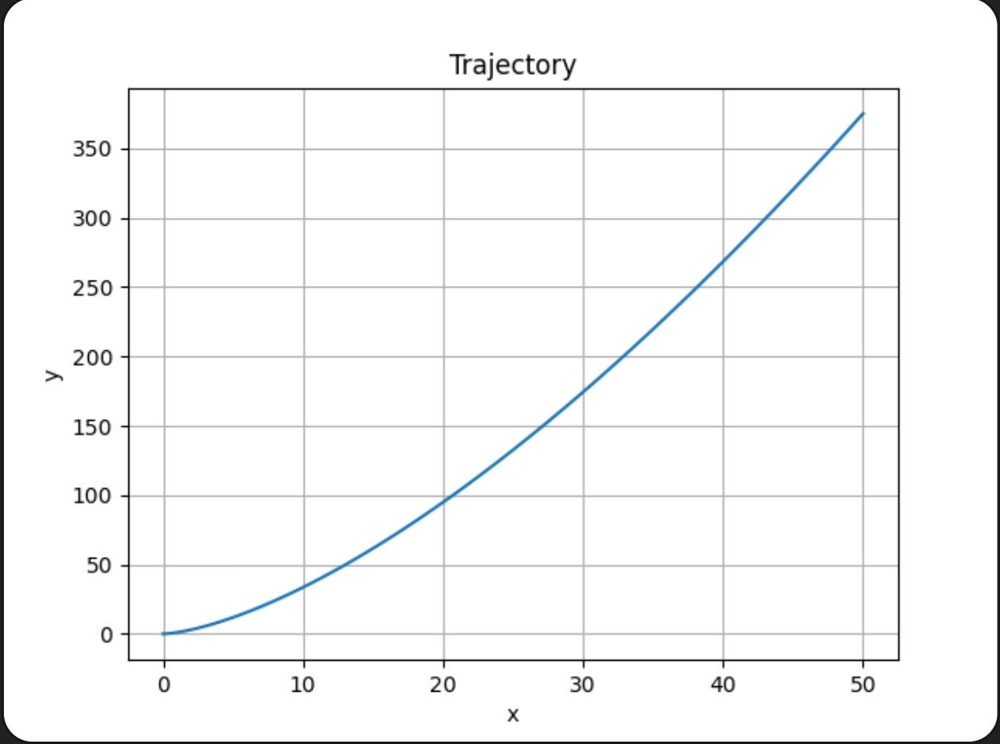

# Problem 7: Elimination of Time and Acceleration

The parametric equations are:

$$
x(t) = 2t^2
$$

$$
y(t) = 3t^3
$$

---

# 1. Eliminate the parameter t

From

$$
x = 2t^2
$$

we solve for \(t\):

$$
t = \sqrt{\frac{x}{2}}
$$

Substitute into the equation for y:

$$
y = 3t^3
$$

$$
y = 3\left(\sqrt{\frac{x}{2}}\right)^3
$$

$$
y = 3\left(\frac{x}{2}\right)^{3/2}
$$

So the trajectory is

$$
y = 3\left(\frac{x}{2}\right)^{3/2}
$$

---

# 2. Velocity vector

Velocity is the derivative of position:

$$
\vec v(t) = \frac{d\vec r}{dt}
$$

Differentiate:

$$
v_x = \frac{dx}{dt} = 4t
$$

$$
v_y = \frac{dy}{dt} = 9t^2
$$

Therefore

$$
\vec v(t) = (4t, 9t^2)
$$

Speed:

$$
|\vec v| = \sqrt{(4t)^2 + (9t^2)^2}
$$

$$
|\vec v| = \sqrt{16t^2 + 81t^4}
$$

---

# 3. Acceleration vector

Acceleration is the derivative of velocity:

$$
\vec a(t) = \frac{d\vec v}{dt}
$$

Differentiate:

$$
a_x = 4
$$

$$
a_y = 18t
$$

So

$$
\vec a(t) = (4, 18t)
$$

Magnitude:

$$
|\vec a| = \sqrt{4^2 + (18t)^2}
$$

$$
|\vec a| = \sqrt{16 + 324t^2}
$$

---

# 4. Is acceleration constant?

The acceleration vector is

$$
\vec a(t) = (4, 18t)
$$

Since the y-component depends on time, the acceleration is **not constant**.

---

# 5. Trajectory plot

The trajectory follows the curve

$$
y = 3\left(\frac{x}{2}\right)^{3/2}
$$

and represents a nonlinear path.

The trajectory can be plotted using Python.

## Trajectory Plot

