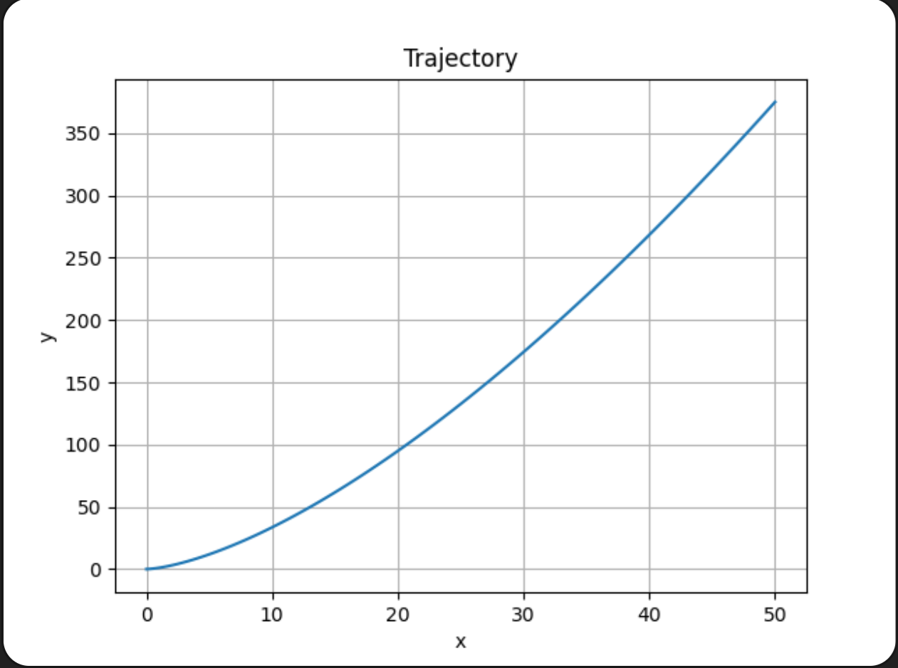

# Problem 7: Elimination of Time and Acceleration

The parametric equations are

$$
x(t)=2t^2,\qquad y(t)=3t^3
$$

---

## 1. Eliminate the parameter \(t\)

From

$$
x=2t^2
$$

we get

$$
t=\sqrt{\frac{x}{2}}
$$

Substitute into \(y(t)\):

$$
y=3t^3 = 3\left(\sqrt{\frac{x}{2}}\right)^3
$$

Thus,

$$
y = 3\left(\frac{x}{2}\right)^{3/2}
$$

This is the equation of the trajectory.

---

## 2. Velocity vector

Velocity is

$$
\vec{v}(t)=\frac{d\vec{r}}{dt}
$$

Differentiate:

$$
v_x=\frac{dx}{dt}=4t
$$

$$
v_y=\frac{dy}{dt}=9t^2
$$

So,

$$
\vec{v}(t) = (4t,\ 9t^2)
$$

---

## 3. Speed

The magnitude of velocity is

$$
|\vec{v}(t)|=\sqrt{(4t)^2+(9t^2)^2}
$$

$$
|\vec{v}(t)|=\sqrt{16t^2+81t^4}
$$

---

## 4. Acceleration vector

Acceleration is

$$
\vec{a}(t)=\frac{d\vec{v}}{dt}
$$

Differentiate:

$$
a_x=4
$$

$$
a_y=18t
$$

So,

$$
\vec{a}(t) = (4,\ 18t)
$$

---

## 5. Magnitude of acceleration

$$
|\vec{a}(t)|=\sqrt{4^2+(18t)^2}
$$

$$
|\vec{a}(t)|=\sqrt{16+324t^2}
$$

---

## 6. Is the acceleration constant?

The acceleration vector is

$$
\vec{a}(t) = (4,\ 18t)
$$

Since the \(y\)-component depends on \(t\), the acceleration is not constant.

---

## Final answers

Trajectory:

$$
y = 3\left(\frac{x}{2}\right)^{3/2}
$$

Velocity:

$$
\vec{v}(t) = (4t,\ 9t^2)
$$

Acceleration:

$$
\vec{a}(t) = (4,\ 18t)
$$

Acceleration is not constant.

---

## Trajectory Plot

