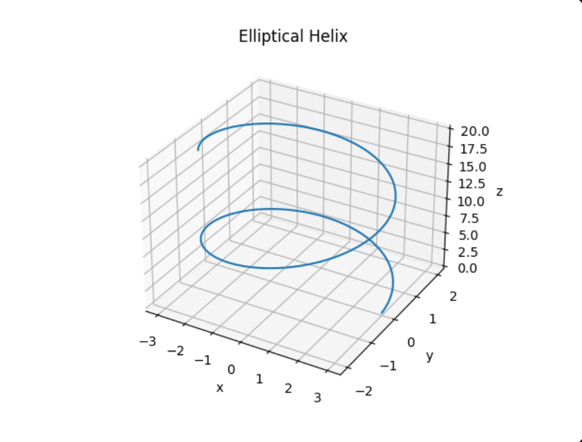

# Problem 10: Kinematics

The position vector is

$$
\vec{r}(t) = (a\cos(\omega t),\, b\sin(\omega t),\, bt)
$$

where \(a\), \(b\), and \(\omega\) are positive constants.

---

## a) Equation of the trajectory

We are given

$$
x(t)=a\cos(\omega t)
$$

$$
y(t)=b\sin(\omega t)
$$

$$
z(t)=bt
$$

From the first two equations

$$
\cos(\omega t)=\frac{x}{a}, \qquad \sin(\omega t)=\frac{y}{b}
$$

Using the trigonometric identity

$$
\cos^2(\omega t)+\sin^2(\omega t)=1
$$

we obtain

$$
\frac{x^2}{a^2}+\frac{y^2}{b^2}=1
$$

Thus, the motion in the \(xy\)-plane is an ellipse.

Since

$$
z=bt \quad \Rightarrow \quad t=\frac{z}{b}
$$

we can also write

$$
x=a\cos\left(\omega \frac{z}{b}\right)
$$

$$
y=b\sin\left(\omega \frac{z}{b}\right)
$$

Therefore the trajectory in space is an **elliptical helix**.

---

## b) Path length from \(t=0\) to \(t=t_0\)

Velocity is the derivative of the position vector

$$
\vec{v}(t)=\frac{d\vec{r}}{dt}
$$

Differentiate each component:

$$
\frac{dx}{dt}=-a\omega \sin(\omega t)
$$

$$
\frac{dy}{dt}=b\omega \cos(\omega t)
$$

$$
\frac{dz}{dt}=b
$$

Thus

$$
\vec{v}(t)=(-a\omega \sin(\omega t),\, b\omega \cos(\omega t),\, b)
$$

The speed is

$$
|\vec{v}(t)|=\sqrt{a^2\omega^2\sin^2(\omega t)+b^2\omega^2\cos^2(\omega t)+b^2}
$$

The path length from \(0\) to \(t_0\) is therefore

$$
L=\int_0^{t_0}|\vec{v}(t)|\,dt
$$

so

$$
L=\int_0^{t_0}\sqrt{a^2\omega^2\sin^2(\omega t)+b^2\omega^2\cos^2(\omega t)+b^2}\,dt
$$

---

## c) Trajectory and special cases

The motion describes an **elliptical helix** in space.

### Special case 1: \(a=b\)

The ellipse becomes a circle

$$
x^2+y^2=a^2
$$

and the motion becomes a **circular helix**.

### Special case 2: \(\omega=0\)

Then

$$
x=a,\qquad y=0,\qquad z=bt
$$

which represents straight-line motion parallel to the \(z\)-axis.

### Special case 3: \(b=0\)

Then

$$
y=0,\qquad z=0
$$

so the motion reduces to

$$
x=a\cos(\omega t)
$$

which is one-dimensional oscillatory motion along the \(x\)-axis.

---

## Final result

The trajectory satisfies

$$
\frac{x^2}{a^2}+\frac{y^2}{b^2}=1
$$

with

$$
z=bt
$$

so the particle moves along an **elliptical helix**.

The velocity vector is

$$
\vec{v}(t)=(-a\omega \sin(\omega t),\, b\omega \cos(\omega t),\, b)
$$

and the arc length from \(0\) to \(t_0\) is

$$
L=\int_0^{t_0}\sqrt{a^2\omega^2\sin^2(\omega t)+b^2\omega^2\cos^2(\omega t)+b^2}\,dt
$$

---

## Trajectory Plot

