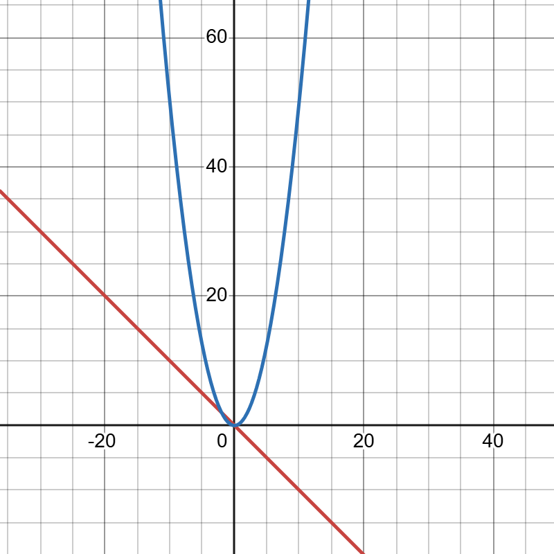

# Problem 8: Work of a Variable Force

We are given the one-dimensional force

$$
F(x) = -kx
$$

We want to:

1. Write the equation of motion and solve it.
2. Calculate the work done from \(0\) to \(x_0\).
3. Interpret the result as potential energy.
4. Verify the relation \(F = -\frac{dU}{dx}\).
5. Draw the graphs of \(F(x)\) and \(U(x)\).

---

## 1. Equation of motion

By Newton's second law,

$$
m\frac{d^2x}{dt^2} = -kx
$$

or

$$
\frac{d^2x}{dt^2} + \frac{k}{m}x = 0
$$

This is the equation of simple harmonic motion.

Its general solution is

$$
x(t) = A\cos(\omega t) + B\sin(\omega t)
$$

where

$$
\omega = \sqrt{\frac{k}{m}}
$$

So the motion is oscillatory.

---

## 2. Work done from \(0\) to \(x_0\)

The work done by the force is

$$
W = \int_0^{x_0} F(x)\,dx
$$

Substitute \(F(x)=-kx\):

$$
W = \int_0^{x_0} (-kx)\,dx
$$

$$
W = -k\int_0^{x_0} x\,dx
$$

$$
W = -k\left[\frac{x^2}{2}\right]_0^{x_0}
$$

$$
W = -\frac{1}{2}k x_0^2
$$

So,

$$
\boxed{W = -\frac{1}{2}k x_0^2}
$$

---

## 3. Interpretation as potential energy

For a conservative force, the work done is related to the change in potential energy by

$$
W = -\Delta U
$$

Since the standard spring potential energy is

$$
U(x)=\frac{1}{2}kx^2
$$

we see that

$$
\Delta U = \frac{1}{2}k x_0^2
$$

Thus the work done by the force is negative because the potential energy increases as the spring is stretched.

---

## 4. Verify \(F = -\frac{dU}{dx}\)

Start from

$$
U(x)=\frac{1}{2}kx^2
$$

Differentiate:

$$
\frac{dU}{dx}=kx
$$

Then

$$
-\frac{dU}{dx}=-kx
$$

which is exactly

$$
F(x)=-kx
$$

So the relation is verified.

---

## 5. Graphs of \(F(x)\) and \(U(x)\)

The force

$$
F(x)=-kx
$$

is a straight line through the origin with negative slope.

The potential energy

$$
U(x)=\frac{1}{2}kx^2
$$

is an upward-opening parabola.

---

## Final answers

Equation of motion:

$$
m\frac{d^2x}{dt^2}=-kx
$$

Solution:

$$
x(t)=A\cos(\omega t)+B\sin(\omega t)
$$

with

$$
\omega=\sqrt{\frac{k}{m}}
$$

Work done from \(0\) to \(x_0\):

$$
\boxed{W=-\frac{1}{2}kx_0^2}
$$

Potential energy:

$$
\boxed{U(x)=\frac{1}{2}kx^2}
$$

Verified relation:

$$
\boxed{F=-\frac{dU}{dx}}
$$

---

## Graphs

