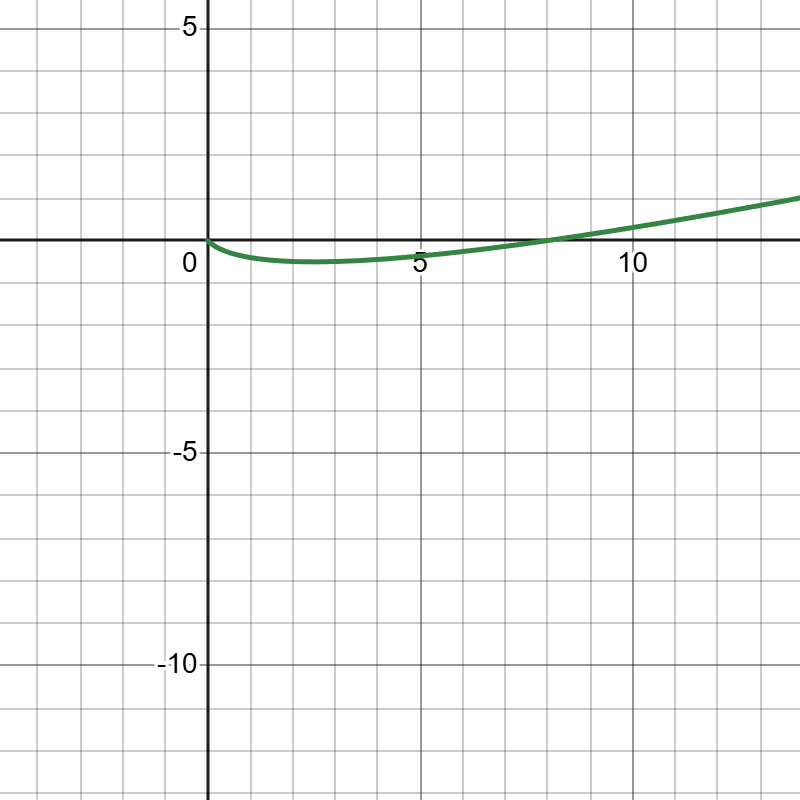

# Problem 12: Work and Energy with a Constant Force

A constant force acts on a body of mass

$$
m = 2\ \mathrm{kg}
$$

The force is

$$
\vec F = [6, 2]\ \mathrm{N}
$$

The initial conditions are

$$
\vec v(0) = (1, -1)\ \mathrm{\frac{m}{s}}
$$

$$
\vec r(0) = (0,0)\ \mathrm{m}
$$

We want to determine \(\vec a(t)\), \(\vec v(t)\), \(\vec r(t)\), the trajectory, the work done at \(t=3\ \mathrm{s}\), and verify the work-energy theorem.

---

## 1. Acceleration

Using Newton's second law,

$$
\vec a = \frac{\vec F}{m}
$$

Substitute the values:

$$
\vec a = \left(\frac{6}{2}, \frac{2}{2}\right)
$$

$$
\vec a = (3,1)\ \mathrm{\frac{m}{s^2}}
$$

So,

$$
\boxed{\vec a(t) = (3,1)}
$$

The acceleration is constant.

---

## 2. Velocity

Velocity is obtained by integrating acceleration:

$$
\vec v(t) = \vec v(0) + \vec a t
$$

So,

$$
\vec v(t) = (1,-1) + (3,1)t
$$

Thus,

$$
\boxed{\vec v(t) = (1+3t,\ -1+t)}
$$

---

## 3. Position

Position is obtained by integrating velocity:

$$
x(t)=\int (1+3t)\,dt = t+\frac{3}{2}t^2 + C_1
$$

Since \(x(0)=0\), we get \(C_1=0\), so

$$
x(t)=t+\frac{3}{2}t^2
$$

For the \(y\)-component:

$$
y(t)=\int (-1+t)\,dt = -t+\frac{1}{2}t^2 + C_2
$$

Since \(y(0)=0\), we get \(C_2=0\), so

$$
y(t)=-t+\frac{1}{2}t^2
$$

Therefore,

$$
\boxed{\vec r(t)=\left(t+\frac{3}{2}t^2,\ -t+\frac{1}{2}t^2\right)}
$$

---

## 4. Trajectory

From

$$
x=t+\frac{3}{2}t^2
$$

and

$$
y=-t+\frac{1}{2}t^2
$$

the motion is a curved trajectory in the plane.

A plot of the trajectory can be obtained from the parametric equations:

$$
x(t)=t+\frac{3}{2}t^2,\qquad y(t)=-t+\frac{1}{2}t^2
$$

---

## 5. Work done by the force at \(t=3\ \mathrm{s}\)

First find the position at \(t=3\):

$$
x(3)=3+\frac{3}{2}(9)=3+13.5=16.5
$$

$$
y(3)=-3+\frac{1}{2}(9)=-3+4.5=1.5
$$

So the displacement from the origin is

$$
\Delta \vec r = (16.5, 1.5)
$$

The work done by a constant force is

$$
W = \vec F \cdot \Delta \vec r
$$

So,

$$
W = (6,2)\cdot(16.5,1.5)
$$

$$
W = 6(16.5) + 2(1.5)
$$

$$
W = 99 + 3 = 102\ \mathrm{J}
$$

Thus,

$$
\boxed{W = 102\ \mathrm{J}}
$$

---

## 6. Check with the work-energy theorem

Initial kinetic energy:

$$
K_i=\frac{1}{2}m(v_x^2+v_y^2)
$$

At \(t=0\),

$$
\vec v(0)=(1,-1)
$$

So,

$$
K_i=\frac{1}{2}(2)(1^2+(-1)^2)=1(2)=2\ \mathrm{J}
$$

Final velocity at \(t=3\):

$$
\vec v(3)=(1+3\cdot3,\ -1+3)=(10,2)
$$

Final kinetic energy:

$$
K_f=\frac{1}{2}(2)(10^2+2^2)=1(100+4)=104\ \mathrm{J}
$$

So,

$$
\Delta K = K_f-K_i = 104-2 = 102\ \mathrm{J}
$$

This matches the work done:

$$
W=\Delta K
$$

So the work-energy theorem is verified.

---

## Final answers

Acceleration:

$$
\boxed{\vec a(t)=(3,1)}
$$

Velocity:

$$
\boxed{\vec v(t)=(1+3t,\ -1+t)}
$$

Position:

$$
\boxed{\vec r(t)=\left(t+\frac{3}{2}t^2,\ -t+\frac{1}{2}t^2\right)}
$$

Work at \(t=3\ \mathrm{s}\):

$$
\boxed{W=102\ \mathrm{J}}
$$

Work-energy theorem:

$$
\boxed{W=\Delta K=102\ \mathrm{J}}
$$

---

## Trajectory Plot

